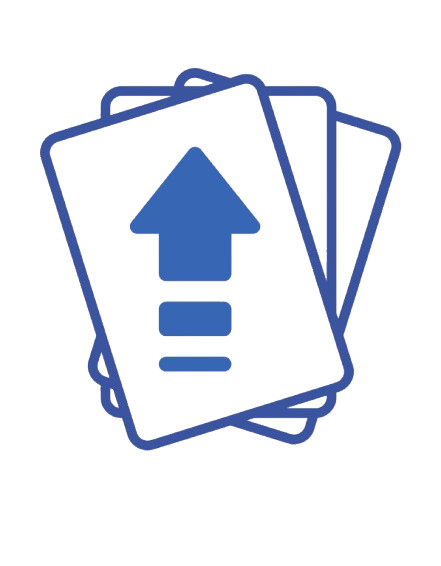

# Stack Up


Stack Up is a Trello-like project planning app that helps users manage tasks efficiently with lists and draggable cards.

- **Deployed App**: [StackUp](https://mystackup.netlify.app)

## Features

- **User Authentication**: Sign up and log in to access your boards.
- **Create and Manage Boards**: Organize your projects with multiple boards.
- **Drag and Drop**: Move cards within lists and between lists seamlessly.
- **Crypto Price Tracking**: Monitor cryptocurrency prices (if applicable).
- **Responsive Design**: Works across all screen sizes.

## Technologies Used

- **Frontend**: React, React DnD, Chart.js
- **Backend**: Node.js, Express, MongoDB, Mongoose
- **Authentication**: JWT (JSON Web Token)
- **Styling**: CSS

## Installation

1. Clone the repository:
   ```sh
   git clone https://github.com/yourusername/stack-up.git
   cd stack-up 

2. Install dependencies for the backend:
    ```sh
    cd backend
    npm install

3. Install dependencies for the frontend:
    ```sh
    cd ../frontend
    npm install

4. Start the development server:
    ```sh
    //BackEnd
    npm start
    //FrontEnd
    npm start

## Next steps
* Continue with CSS Styling
* Add the ability to have public and private boards
* Implement a global serach function
* Add the ability to follow other useres boards
